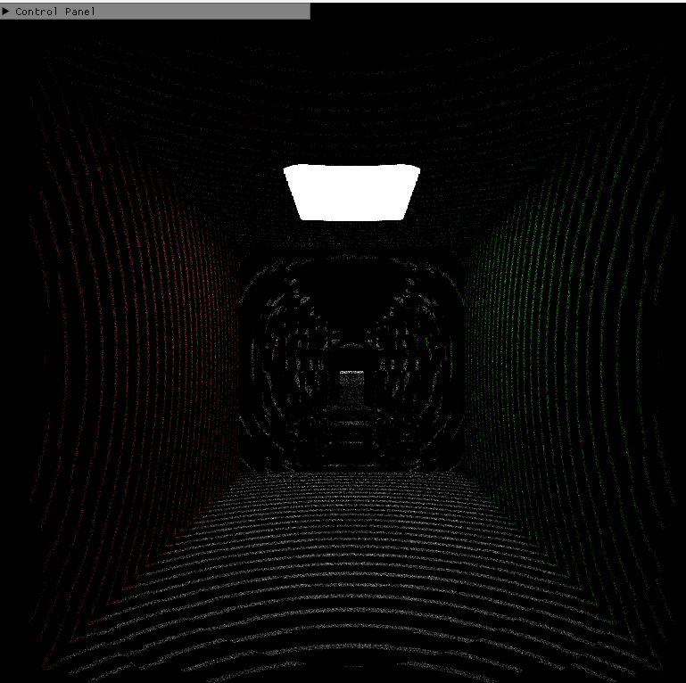

# Overview
This is a GPU based path tracer. The project focus on improving performance of the path tracer using screen space tracing, ray marching with SDF, and radiance cache.

# Features
### `Screen Space Tracing`

placeholder

### `Ray Marching with SDF`
The image below is run on our [experiment CUDA path tracer project](https://github.com/linlinbest/SDFPathTracer).
Ray Marching with SDF (17.6 FPS)  |  Ray Tracing  (4 FPS)
:-------------------------:|:-------------------------:
        |  

As we can see from the image, the performance improvement is huge. Ray marching with SDF is roughly 4 times faster than ray tracing method.
However, ray marching with SDF can cause rendering in some parts of the scene inaccurate.

### `Radiance Cache`

The current image below is buggy....

The basic idea of radiance cache is to precompute part of point's incoming radiance, and use Hemisphere Harmonic to represent them.

After precompute radiance cache, when doing path tracing and get intersection, first find the nearest radiance cache point, then use interpolation to calculate this point's diffuse radiance.

But to successfully interpolate, need to compute the HSH coefficient's partial derivatives.

HSH Coefficient compute    |  Ray Tracing  (4 FPS)
:-------------------------:|:-------------------------:
        |  

# Readme from Our Base Code

This repository is intended to be used as a code repository for learning DirectX 12. The tutorials can be found on https://www.3dgep.com

This project uses [CMake](https://cmake.org/) (3.18.3 or newer) to generate the project and solution files.

To use this project, run the [GenerateProjectFiles.bat](GenerateProjectFiles.bat) script and open the generated Visual Studio solution file in the build_vs2017 or build_vs2019 folder that gets created (depending on the version of Visual Studio you have installed).

Assets for the samples can be downloaded using the [DownloadAssets.bat](DownloadAssets.bat) batch file located in the root folder of this project.

For more instructions see [Getting Started](https://github.com/jpvanoosten/LearningDirectX12/wiki/Getting-Started).