# Overview
This is a GPU based software ray tracer implemented with DirectX 12 and C++. The project focus on improving performance of the path tracer using screen space tracing, ray marching with SDF, and radiance cache. The `software` means we didn't use DXR API, instead did most part of jobs in compute shaders.

Our [slides](https://docs.google.com/presentation/d/1KqtTNHKcfJJmezH87nCHo02NYfXkfuNJ8oHE3m2dz4k/edit#slide=id.g1b267a0d5b1_1_1)

# Getting Started

This project uses CMake (3.18.3 or newer) to generate the project and solution files.

Assets for the samples can be downloaded using the [DownloadAssets.bat](DownloadAssets.bat) batch file located in the root folder of this project.

The base code was from the tutorial on https://www.3dgep.com, then we modified and added codes based on it. We mainly added some compute shader pipeline in `DX12Lib`, and modified files in `samples/05-Models` to implement our pipeline. To build and open our program, set the `samples/05-Models` as startup project.

# Pipeline
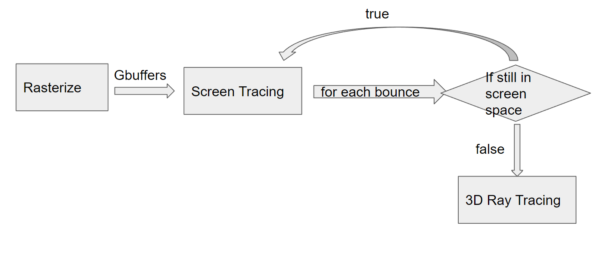

### `Rasterize`
The first part is rasterize, but instead of compute full lights, we only output some Gbuffers (normal, depth, mesh color), which will be used in `Screen Space Tracing`
### `Screen Space Tracing`
We use Gbuffers to first trace ray in screen space. If the ray is out of the screen space, the pipeline will fall back to `3D Ray Tracing`.
### `3D Ray Tracing`
It's actually ray marching based on SDF (Signed Distance Field). It's an important part to accelerate our path tracer.

# Features
### `Screen Space Tracing`
The SDF is based on voxels, so it's not very accurate, especially rendering mesh with textures. Therefore, we add screen tracing to deal with direct lighting and first few bounces. 

Pure SDF scene  |  Add screen tracing
:-------------------------:|:-------------------------:
        |  

In detail, we use depth texture to do screen-space ray marching, and we use mipmap of depth texture to accelerate the process. Then we use normal texture to get normal on the hit point and sample the next direction. 

### `Ray Marching with SDF`
Ray marching using signed distance field (SDF) is a intersection testing method which is typically faster than ray tracing. Ray marching against primitives are frequently used since it's fast and SDF of primitives can be easily expressed as mathmatical formulas. However, ray marching against arbitrary mesh becomes complicated because the SDF of arbitrary mesh can't be expressed with formulas. Therefore, we want to generate SDF for arbitrary mesh so that ray marching can be applied on any mesh.

The basic idea of our implementation is that we create a bunch of voxels to approximately represent every position in the space. When ray marches to a voxel, it knows the the distance to the next closest triangle based on what's stored in the voxel. Then the ray is able to march with the biggest step to save time.  

**The render results below are produced with our [experiment CUDA path tracer project](https://github.com/linlinbest/SDFPathTracer)**.
Ray Marching with SDF (17.6 FPS)  |  Ray Tracing  (4 FPS)
:-------------------------:|:-------------------------:
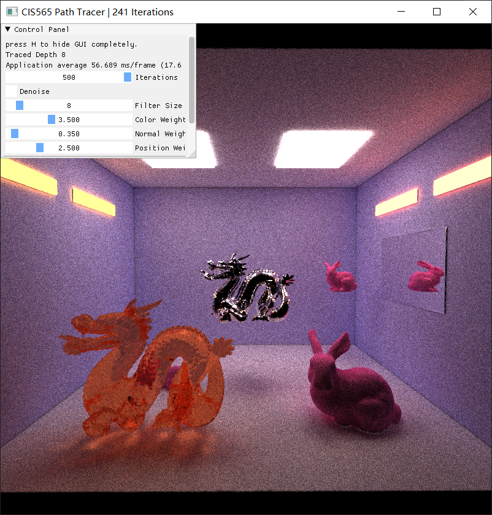        |  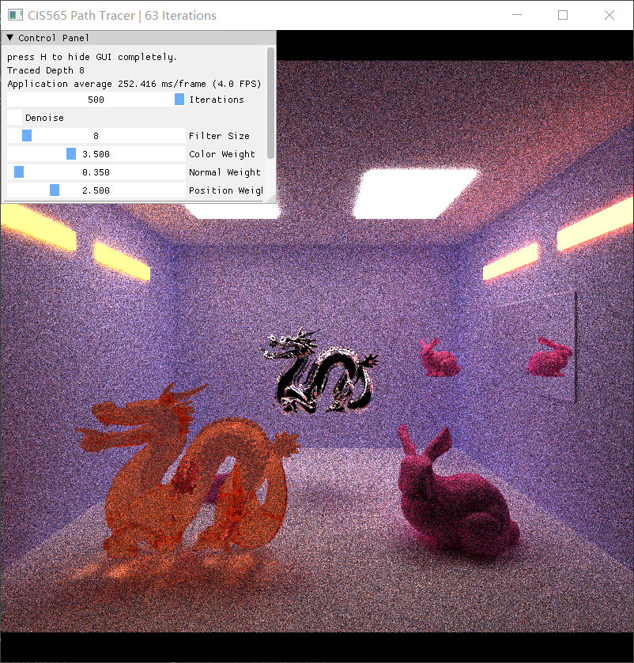

As we can see from the image, the performance improvement is huge. Ray marching with SDF is much faster than ray tracing method. Even if there are more geometries in the scene, ray marching with SDF still maintains stable FPS, while FPS would drop with ray tracing.
However, ray marching with SDF can cause rendering in some parts of the scene inaccurate.  

In addition, ray marching with low resolution SDF voxels also produce inaccurate results.

Ray marching with low resolution SDF voxels (run on CUDA path tracer)
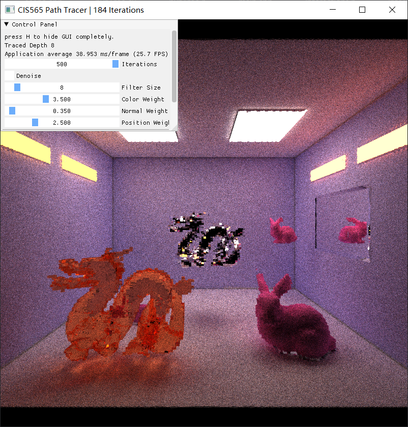

Ray marching with low resolution SDF voxels (run on DirectX 12 path tracer)

### `Radiance Cache`

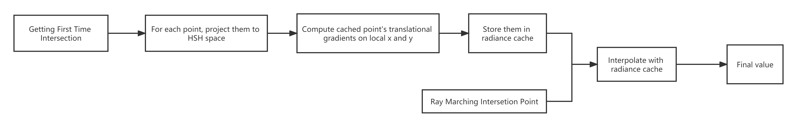

The basic idea of radiance cache is to precompute part of point's incoming radiance, and use Hemisphere Sperical Harmonic function to encode them.

After getting cached points, when doing ray marching in SDF and getting intersections, for each intersection need to check the cache list to find the nearest point, and then compute it's translational ingradient value to interpolate between these two points.

Hemisphere Spherical Harmonic Function |  Derivative Computation Formula
:-------------------------:|:-------------------------:
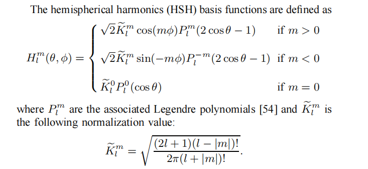       | 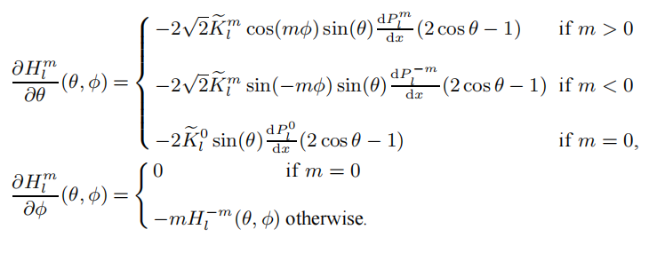

Then after having these values it will be possible to get the interpolated radiance value by using these formulas:

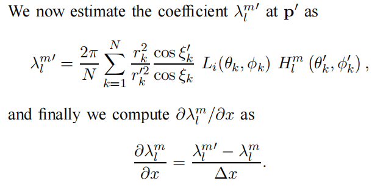

after computing x direction, you also need to compute y direction. The formula picture express is as followed:

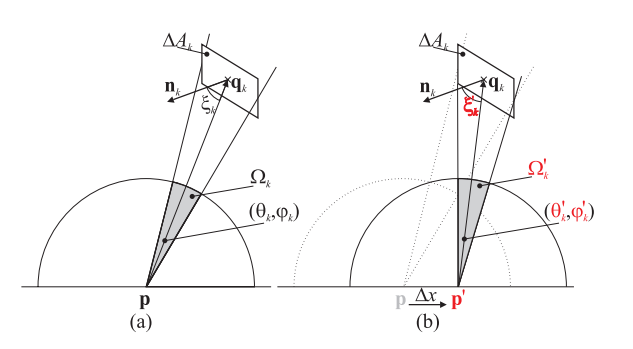

Though the implement has been finished and looked right, but in real test, we find out that this computation is too heavy because every intersection need to check whether this point has been cached or having near cached point, the computation complexity is very high, and instead of acclerating, it will slow down the whole process greatly, perhaps we made something wrong and need further studying.

Render with Radiance Cache| Pure Radiance Cache
:-------------------------:|:--------------------:
 | 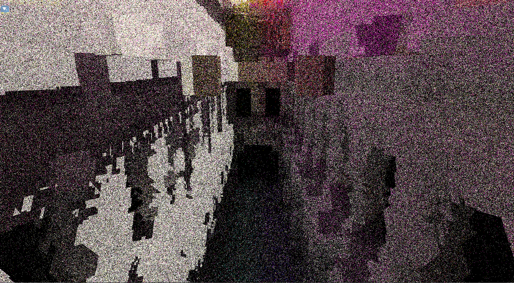

### `Small trick to soften the shadow`
Notice that the shadow of the parallel light must be related to 3D ray marching (we don't know if there are objects over the screen space), so the shape of the shadow is always jagged because of the voxel based SDF.

To soften the shadow, we randomly bias the start position of a new ray after a bounce in a small range of planar perpendicular to the normal.

Hard shadow  |  Soft shadow
:-------------------------:|:-------------------------:
        |  

# Performance Analysis

### **How much faster is ray marching with SDF comparing to ray tracing with BVH?**

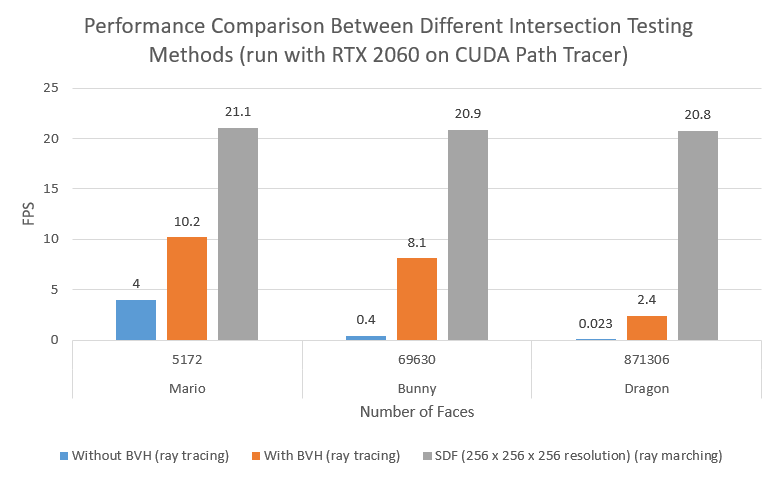

As we can see, with increasing number of faces, the FPS of ray marching method is very stable while the FPS of ray tracing methods drops. The performance with ray marching is independent of the number of triangles in the scene.

The reason of this result is that once the SDF voxels are generated with a fixed resolution, the performance of ray marching would be fixed as well. Every ray marching step is based on the distance to the closest triangle. Within a few steps, intersection testing would be done. Thus, the complexity of ray marching is independent of the number of triangles. For ray tracing methods, however, it has to find the closest triangle intersection by iterating through all triangles. Even with BVH acceleration structure, the complexity is still related to the number of triangles. That's why ray marching is much faster than ray tracing. It becomes more obvious if there are more triangles in a scene.

### **How does resolution of SDF affect the performance of the path tracer?**

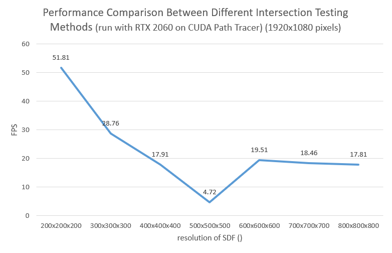

According to the data, when the resolution is low, the performance of the path tracer imporves as the resolution increases. After reaching a threshold, the performance of the path tracer won't improve anymore.

This is because when the resolution of SDF is low, the number of voxels is not enough to contain every triangles in a single voxel. Ray marching is fast since there aren't many voxels for marching. However, the rendering result would be very inaccurate because the closest distance to triangle stored in a voxel cannot accurately represent the closest distance to triangle from the position of marching ray.

When the resolution is high enough, a voxel can approxiamate the closest distance to triangle from the position of marching ray if the marhing ray is within the voxel. The total marching steps would be the same even if the resolution increases. Thus, the performance would remain the same.

It's worth noticing that the FPS suddenly drops a lot when the resolution is 500 x 500 x 500. We haven't figure out the reason of this phenomenon.

# Reference
[Screen Space Ray Tracing](http://casual-effects.blogspot.com/2014/08/screen-space-ray-tracing.html)

[Lumen Techniques](
https://docs.unrealengine.com/5.0/en-US/lumen-technical-details-in-unreal-engine/)

[DirectX-12 Tutorial](https://www.3dgep.com/category/graphics-programming/directx/directx-12/)

[Ray Marching and Signed Distance Functions](https://jamie-wong.com/2016/07/15/ray-marching-signed-distance-functions/#surface-normals-and-lighting)

[SDF Generation for Mesh](https://airguanz.github.io/2021/06/28/sdf-gen.html)

About radiance Cache, reference papers are: 

[Radiance Caching for Efficient Global Illumination Computation, Jaroslav Kˇriv´anek, Pascal Gautron, Sumanta Pattanaik,Kadi Bouatouch](https://ieeexplore.ieee.org/abstract/document/1471692?casa_token=-TjDUZai2icAAAAA:nT32X7qk0BOrr6hBMzVPiMp3oA34z4GUbyvrYGjTRy7RzI59D3j_6CEz9LsVPpInolJqo-qgPA)

[Fast, Arbitrary BRDF Shading for Low-Frequency Lighting Using Spherical Harmonics,Jan Kautz, Peter-Pike Sloan and John Snyder](https://www.ppsloan.org/publications/shbrdf_final17.pdf)

[A Novel Hemispherical Basis for Accurate and Efficient Rendering,Pascal Gautron,Jaroslav Krivanek,Sumanta Pattanaik,Kadi Bouatouch](http://diglib.eg.org/bitstream/handle/10.2312/EGWR.EGSR04.321-330/321-330.pdf?sequence=1&isAllowed=y)

[Radiance Cache Splatting: A GPU-Friendly Global Illumination Algorithm](http://www.cs.ucf.edu/~ceh/Publications/Papers/Rendering/EGSR05GautronEtAl.pdf)

# Readme from Our Base Code

This repository is intended to be used as a code repository for learning DirectX 12. The tutorials can be found on https://www.3dgep.com

This project uses [CMake](https://cmake.org/) (3.18.3 or newer) to generate the project and solution files.

To use this project, run the [GenerateProjectFiles.bat](GenerateProjectFiles.bat) script and open the generated Visual Studio solution file in the build_vs2017 or build_vs2019 folder that gets created (depending on the version of Visual Studio you have installed).

Assets for the samples can be downloaded using the [DownloadAssets.bat](DownloadAssets.bat) batch file located in the root folder of this project.

For more instructions see [Getting Started](https://github.com/jpvanoosten/LearningDirectX12/wiki/Getting-Started).
