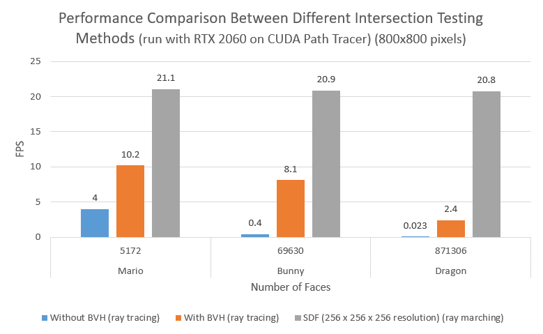

# Overview
This is a GPU based path tracer. The project focus on improving performance of the path tracer using screen space tracing, ray marching with SDF, and radiance cache.

# Pipeline

# Features
### `Screen Space Tracing`

Because ray marching with SDF is not very accurate, we add screen tracing to deal with direct lighting and first few bounces. And to get Gbuffers used in screen tracing, we also add a simple rasterizing pipeline

Direct light  |  Direct light + 3 bounces with screen tracing
:-------------------------:|:-------------------------:
        |  

### `Ray Marching with SDF`
The render results below is produced with our [experiment CUDA path tracer project](https://github.com/linlinbest/SDFPathTracer).
Ray Marching with SDF (17.6 FPS)  |  Ray Tracing  (4 FPS)
:-------------------------:|:-------------------------:
        |  

As we can see from the image, the performance improvement is huge. Ray marching with SDF is roughly 4 times faster than ray tracing method. Even if there are more geometries in the scene, ray marching with SDF still maintains stable FPS, while FPS would drop with ray tracing.
However, ray marching with SDF can cause rendering in some parts of the scene inaccurate.

Ray marching with low resolution SDF voxels (run on CUDA path tracer)

Ray marching with low resolution SDF voxels (run on DirectX 12 path tracer)

### `Radiance Cache`

The current image below is buggy....

The basic idea of radiance cache is to precompute part of point's incoming radiance, and use Hemisphere Harmonic to represent them.

After precompute radiance cache, when doing path tracing and get intersection, first find the nearest radiance cache point, then use interpolation to calculate this point's diffuse radiance.

But to successfully interpolate, need to compute the HSH coefficient's partial derivatives.

HSH Coefficient compute    |  Ray Tracing  (4 FPS)
:-------------------------:|:-------------------------:
        |  

# Performance Analysis

### How much faster is ray marching with SDF comparing to ray tracing with BVH?

As we can see, with increasing number of faces, the FPS of ray marching method is very stable while the FPS of ray tracing methods drops. The performance with ray marching is independent of the number of triangles in the scene.

The reason of this result is that once the SDF voxels are generated with a fixed resolution, the performance of ray marching would be fixed as well. Every ray marching step is based on the distance to the closest triangle. Within a few steps, intersection testing would be done. Thus, the complexity of ray marching is independent of the number of triangles. For ray tracing methods, however, it has to find the closest triangle intersection by iterating through all triangles. Even with BVH acceleration structure, the complexity is still related to the number of triangles. That's why ray marching is much faster than ray tracing. It becomes more obvious if there are more triangles in a scene.

### How does resolution of SDF affect the performance of the path tracer?

# Readme from Our Base Code

This repository is intended to be used as a code repository for learning DirectX 12. The tutorials can be found on https://www.3dgep.com

This project uses [CMake](https://cmake.org/) (3.18.3 or newer) to generate the project and solution files.

To use this project, run the [GenerateProjectFiles.bat](GenerateProjectFiles.bat) script and open the generated Visual Studio solution file in the build_vs2017 or build_vs2019 folder that gets created (depending on the version of Visual Studio you have installed).

Assets for the samples can be downloaded using the [DownloadAssets.bat](DownloadAssets.bat) batch file located in the root folder of this project.

For more instructions see [Getting Started](https://github.com/jpvanoosten/LearningDirectX12/wiki/Getting-Started).